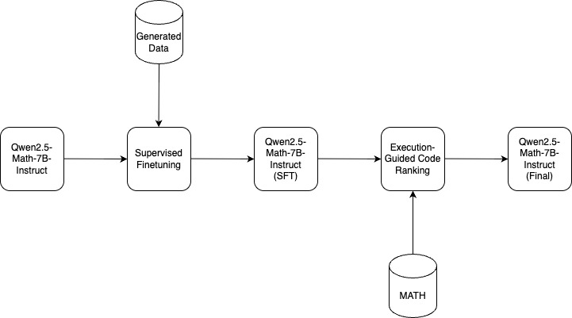
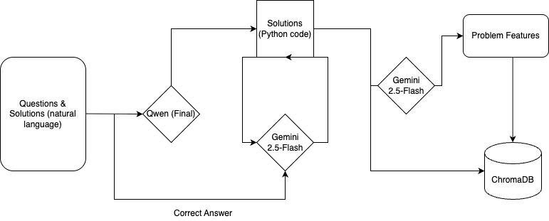
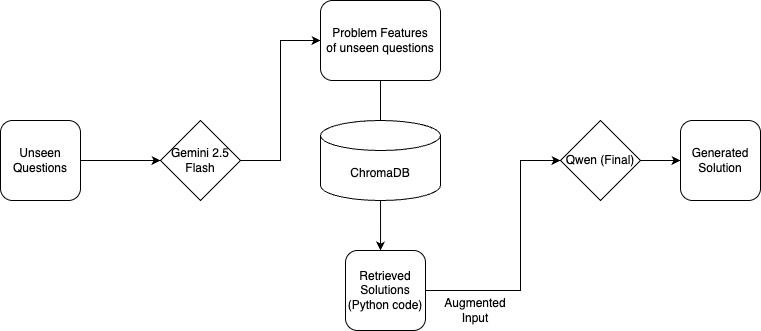

# MathLearner

Hệ thống MathLearner giúp giải quyết các bài toán dựa trên các bài mẫu. Nó mô phòng quá trình học hỏi của con người

## 1. Quá Trình Tinh Chỉnh Mô Hình `Qwen2.5-Math-7B-Instruct`
Sau đây là mô tả chi tiết toàn bộ quá trình finetuning mô hình `Qwen2.5-Math-7B-Instruct` nhằm mục đích chuyển đổi các bài toán học sang mã Python chính xác và hiệu quả, đồng thời tăng độ chính xác và tính giải thích của mô hình LLM.
Pipeline huấn luyện gồm hai giai đoạn chính:
+ Supervised Fine-tuning
+ Execution-Guided Code Ranking



### 1.1 Supervised Fine-tuning
Trong giai đoạn đầu tiên, mô hình Qwen2.5-Math-7B-Instruct được tinh chỉnh bằng phương pháp học có giám sát (Supervised Fine-tuning) trên một tập dữ liệu chất lượng cao được tổng hợp từ các bộ dữ liệu toán khác nhau.

Nguồn dữ liệu đến từ việc tổng hợp và tăng cường (augmented) bằng công cụ sinh ngôn ngữ `Gemini 2.5-Flash`, tạo thành một tập gồm 20,000 điểm dữ liệu chất lượng cao.

```json
{
  "problem": "<Bài toán>",
  "answer": "<Đáp án bài toán>",
  "python_code": "<Mã Python giải bài toán>"
}
```

Mục đích huấn luyện:
+ Dạy cho mô hình khả năng hiểu ngữ nghĩa của bài toán toán học

+ Học cách diễn giải lời giải dưới dạng mã Python có thể thực thi

+ Đảm bảo mô hình học logic toán học phổ quát và biết cách áp dụng cấu trúc code như biến, vòng lặp, điều kiện, công thức, v.v.

Quá trình huấn luyện được tối ưu bằng hàm mất mát Cross Entropy, mục tiêu là thu nhỏ sai lệch giữa chuỗi mã Python mô hình sinh ra và chuỗi mã đúng từ dữ liệu.

$$\mathcal{L}_{CE}(\theta) = -\frac{1}{T} \sum_{t=1}^{T} \log P_{\theta}(y_t \mid y_{<t}, x)$$

Trong đó:
+ $\theta$: Tham số của mô hình

+ $x$: Chuỗi đầu vào (bài toán tiếng Việt)

+ $y = (y_1, y_2, ..., y_T)$: Chuỗi token đầu ra tương ứng với mã Python mục tiêu

+ $P_{\theta}(y_t \mid y_{<t}, x)$: Xác suất mô hình gán cho token $y_t$, dựa trên các token trước đó và chuỗi đầu vào $x$

+ $T$: Độ dài của chuỗi đầu ra

### 1.2 Execution-Guided Code Ranking (EGCR)
Sau khi mô hình được tinh chỉnh với Supervised Fine-tuning, ta tiếp tục cải thiện độ chính xác bằng một cơ chế phản hồi dựa trên thực thi — gọi là Execution-Guided Code Ranking (EGCR). Cơ chế này mô phỏng cách con người thử nghiệm và điều chỉnh từng bước giải để đạt được kết quả đúng.

Tập dữ liệu sử dụng trong giai đoạn này được xây dựng dựa trên các bài toán từ MATH Dataset. Mỗi bài toán được phân tách thành các bước nhỏ (subproblems hoặc subfunctions), từ đó sinh ra nhiều đoạn mã ứng viên.

Cấu trúc một mẫu dữ liệu gồm:

```json
{
  "problem": "<Bài toán toán học>",
  "steps": [
    {
      "description": "Tính tổng số học sinh nữ",
      "candidates": ["<code_1>", "<code_2>", "<code_k>"]
    },
    {
      "description": "Tính số học sinh nam",
      "candidates": ["<code_1>", "<code_2>", "<code_k>"]
    }
  ],
  "answer": "<Đáp án cuối>"
}
```

Mục đích huấn luyện:
+ Giúp mô hình tự sinh ra các đoạn mã con (subfunctions) đúng cho từng bước của lời giải toán học.

+ Học cách ưu tiên chọn đoạn mã đúng thông qua kết quả thực thi.

+ Loại bỏ các đoạn mã có lỗi syntax hoặc cho kết quả sai bằng cơ chế chấm điểm tự động.

Quy trình huấn luyện như sau:

1. Sinh candidate: Với mỗi bước nhỏ trong bài toán, mô hình sinh ra $k$ đoạn mã Python ứng viên.

2. Kết hợp tổ hợp ứng viên: Tạo tất cả các tổ hợp có thể giữa các bước: ví dụ nếu mỗi bước có $k=3$ ứng viên thì tổng số tổ hợp là $k^n$ (với $n$ là số bước nhỏ).

3. Chấm điểm: Thực thi từng tổ hợp trong Python Interpreter.
    + Nếu tổ hợp cho ra đáp án đúng → mỗi đoạn mã ứng viên trong tổ hợp đó được cộng +1 điểm.

    + Nếu kết quả sai → mỗi đoạn mã được chấm 0 điểm.

    + Nếu mã lỗi syntax hoặc không thực thi → –1 điểm.

4. Tính loss: Sau khi có điểm, sử dụng hàm BRIO ranking loss để tối ưu thứ tự sinh mã theo độ chính xác.

$$\mathcal{L}_{BRIO}(\theta) = -\frac{1}{K} \sum_{k=1}^{K} (S(y_k) - S(y^*)) \cdot \log \frac{P_{\theta}(y_k \mid x)}{P_{\theta}(y^* \mid x)}$$

Trong đó:

+ $S(y_k)$: Điểm của đoạn mã ứng viên thứ $k$

+ $y^*$: Ứng viên tốt nhất (có điểm cao nhất)

+ $P_{\theta}(y_k \mid x)$: Xác suất sinh ra $y_k$ từ mô hình

+ $K$: Tổng số ứng viên

Cuối cùng, loss tổng thể là:

$$\mathcal{L}_{final}(\theta) = \mathcal{L}_{CE}(\theta) + \lambda \cdot \mathcal{L}_{BRIO}(\theta)$$

Với $\lambda$ là hệ số điều chỉnh giữa loss sinh mã và loss đánh thứ hạng (thường nằm trong khoảng 0.1 đến 0.5).

## 2. Hệ Thống MathLearner
`MathLearner` mô phỏng cách con người học giải toán: quan sát → hiểu → lưu kinh nghiệm → vận dụng cho bài mới. Hệ thống gồm hai tầng chính – Module Học (Learning Module) và Module Ứng dụng (Application Module) – được vận hành bởi mô hình `Qwen2.5‑7B‑Math‑Instruct` đã tinh chỉnh ở giai đoạn 1. Đồng thời, hệ thống tích hợp RAG (Retrieval Augmented Generation) để lấy những bài toán mẫu được cho là đồng dạng nhất với bài đoán đang được quan tâm. Điều nãy sẽ vô cùng hữu ích cho những trung tâm nhỏ vì họ có thể tiết kiệm chi phí thu thập data để huấn luyện mô hình. Hơn nữa, hệ thống này vô cùng flexible.

### 2.1 Learning Module
+ Đầu vào: Bài toán gốc + lời giải gốc
+ Đầu ra: Lời giải đã chỉnh sửa dưới dạng mã Python + các đặc trưng của bài toán



Quá trình của mô-đun này diễn ra như sau:
1. **Nhận dữ liệu huấn luyện:**  
   LLM sẽ được tiếp xúc với nhiều dạng bài toán đa dạng và lời giải từng bước chi tiết từ các tập dữ liệu liên quan đến các kỳ thi học thuật.  
   Trong bản demo, chúng tôi sử dụng tập dữ liệu [MetaMathQA](https://huggingface.co/datasets/meta-math/MetaMathQA) — một bộ dữ liệu lớn được tổng hợp từ nhiều nguồn uy tín, bao gồm các bài toán khó cùng lời giải suy luận từng bước.

2. **Sinh lời giải Python code**
    LLM sinh ra câu trả lời bằng 1 chương trình Python.

3. **Kiểm chứng**
    Kiểm chứng xem đáp án có giống ground-truth hay không. Nếu không, LLM sẽ được prompt để sinh lại đáp án. Trong promp này sẽ gồm error message + question. Quá trình diễn ra trong 5 vòng lặp. 

4. **Sinh features**
    Sau khi thành công sinh ra python code cho mỗi bài toán, LLM sẽ dựa vào chúng để sinh ra `problem features`. Những features này sẽ được dùng để trích các lời giải mẫu (trong phần Application Module):
    + General type: dạng bài
    + Specific topics: chủ đề cụ thể 
    + Operations: các toán tử liên quan
    + Theorems: các định lý liên quan
    + Difficulty evel: độ khó

5. **Tạo thành embeddings**
    Cuối cùng, các features dạng văn bản sẽ được mã hoá thành vector embeddings và được lưu vào **ChromaDB** vector database.
    Database này giống như một bộ não của MathLearner vậy, cho phép trích xuất ra các câu hỏi đồng dạng cho các bài toán mới sau này. Nó phản ánh tương đối chính xác quá trình con người học.

### 2.2 Application Module
+ Đầu vào: bài toán mới
+ Đầu ra: Câu trả lời đã được kiểm chứng 



Quá trình mô-đun này diễn ra như sau:
1. **Nhận câu hỏi**
    LLM nhận câu hỏi đầu vào.

2. **Sinh ra features**
    Giống như quá trình sinh features trong Learning Module, LLM sinh ra các features cho câu hỏi mới.

3. **Trích xuất câu hỏi đồng dạng**
    Các features vừa được sinh ra sẽ biến thành vector embeddings để thực hiện quá trình trích xuất (3 ứng cử viện). Sau đó những ứng cứ viên sẽ được concatenate với câu hỏi ban đầu là prompt mới cho LLM để giải quyết bài toán.

4. **Sinh ra đáp án**
    LLM sẽ được khuyến khích sinh ra Python code để kiếm chứng bài toán, đồng thời tăng khả năng giải quyết vấn đề của LLM và tính giải thích. Sau đó đáp án cuối cùng sẽ được gửi về cho user, đồng thời đoạn Python code.
